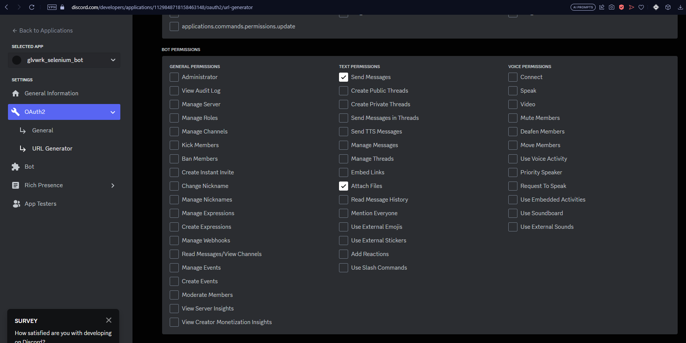
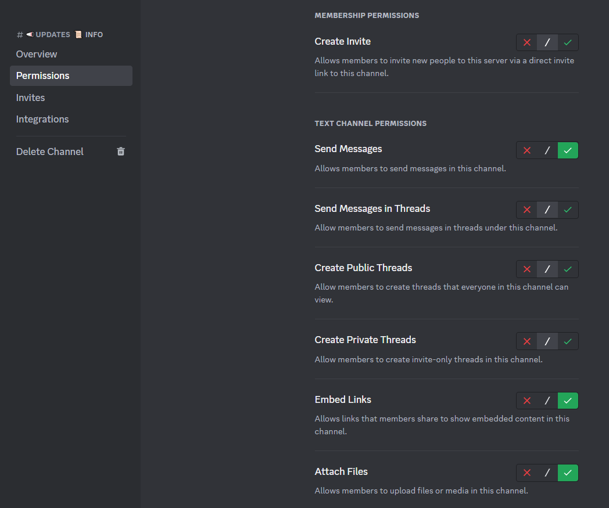

# 🤖gloveworks_screenshot_bot

## About
### This is a discord screenshot bot specifically for the Counter Strike Community: Gloveworks


---

## Purpose

### Gloveworks hosts a monthly contest where the top player can receive a prize. However, there have been times where it has been uncertain who was the top player on the last day of the month at exactly 7 PM PST. That's what this bot aims to solve! This Discord Bot will take a screenshot of a website on the last day of the month at 7 PM PST. It also allows you to request a screenshot on demand.

---

## Prerequisite

- A linux machine configured with PST time
- Docker installed (look at the documentation for your distro)
- A Discord account (to create the bot on the Discord Developer Portal)
- At least 2GBs on storage on your Linux machine

---

## How does it work?

### The python script is what activates the bot, but the python libraries is what makes the magic happen
* python3-discord (python module for discord APIs)
* python3-selenium (python module for selenium - supports screenshots and much more automation)
* apscheduler (python module allows us to choose when the bot wakes up and takes a screenshot)
* discord_ext_bot (python module for discord bot APIs)
* webdriver_manager (python module for spinning up chromium from python)

### The docker image is just a nice way to package all of the dependencies that is required by the python script, and also freeze the software such that Gloveworks can dependently rely on this bot. It uses an existing docker image seleniarm/standalone-chromium, which is a modified Debian Linux image that supports automation capabilities inside docker.

---

## Create and invite your own discord bot
1. Log into the discord developer portal: https://discord.com/developers/applications

2. Create new application, name it whatever you want, and agree to the ToS

3. Once the page refreshes, go to OAuth2, and click on URL Generator

4. Under "Scopes", checkbox "bot"

5. Under "Role Permissions", checkbox "Send Messages" and "Attach Files"

5. Scroll to the bottom, copy the Generated URL and paste it into an address bar in your browser

6. Invite it to your server

7. Head back to the Discord Developer Page and configure the bots username, and click "Reset" token

Remember the token, the bot will need it to come online! If you forget it, you will have to regenerate it!

8. On the Discord server, modify the channel permissions for the bot's role


Congratulations you just created and invited your own discord bot!

---

## How to run on your PC

You can run the python script directly on your PC. Note that you will need to have `chromium` and `chromium-chromedriver` installed and added to the PATH.

```bash
python3 discord_screenshot_bot.py [-c|--config] <config-file>
```

> NOTE: If you already added the discord bot token and channel ID as environment variables, you don't need to specify the config file. It will default to use the environment variables.

---

## How to run in a Docker container

### Build the image

- You can build the image directly with the `run.sh` file but passing the `-b|--build` flag. Use `./run.sh --help` for more information on the image name:

```bash
./run.sh -c <config-file> [-b|--build]
```

> NOTE: Because of the way flags are parsed, the -b flag needs to be at the end. This is due to the fact that the parser is looking for a flag-value pair

### With config file

- Create a config file (e.g. `.config`) with the following format and flags:

```
TOKEN = "<bot_token>"
ID = "<channel_id>" # "692925474032320542"
IMAGE = "<docker_image_name>" # "hiddenglovework/ss-discordbot:v1.0.0"
CONTAINER_NAME = "<container_name>" # "gw-discord-ss-bot"
```

> NOTE: Make sure to include the space around the `=` and wrap all values in double quotes (the config parsing is very basic)

- Run the run.sh:

```bash
./run.sh [-c | --config] <config_file_path>
```

> NOTE: for more information on the script run: `./run.sh --help`

### With flags

Run `./ruin.sh --help` for more information on what flags are needed.

---

## How to kill the docker image

```bash
docker stop <docker_container_id>

# or

docker stop <docker_container_name>
```

> NOTE: To find the container id, run `[sudo] docker ps`.

---

## How to test the discord bot:

```bash
# in the discord channel where the bot is active type this message:
@<insert_bot_name> !screenshot <insert_url>
```

---

## Help (Feature Requests/Bug fixes)

### Troubleshoot: modify the run.sh script to not run the docker container as "-d" detach mode but instead "--it" interactive mode and replace gw-discord-ss-bot with /bin/bash

### Contact Hidden through gloveworks and forward me any logs. I will do my best to troubleshoot it
