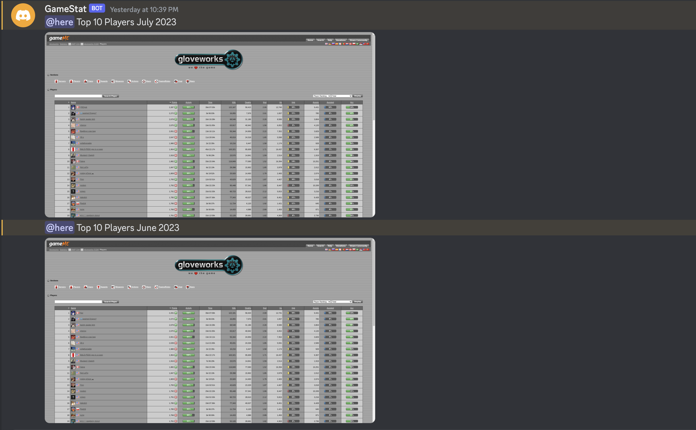
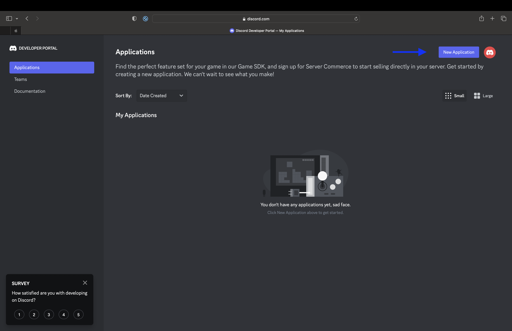
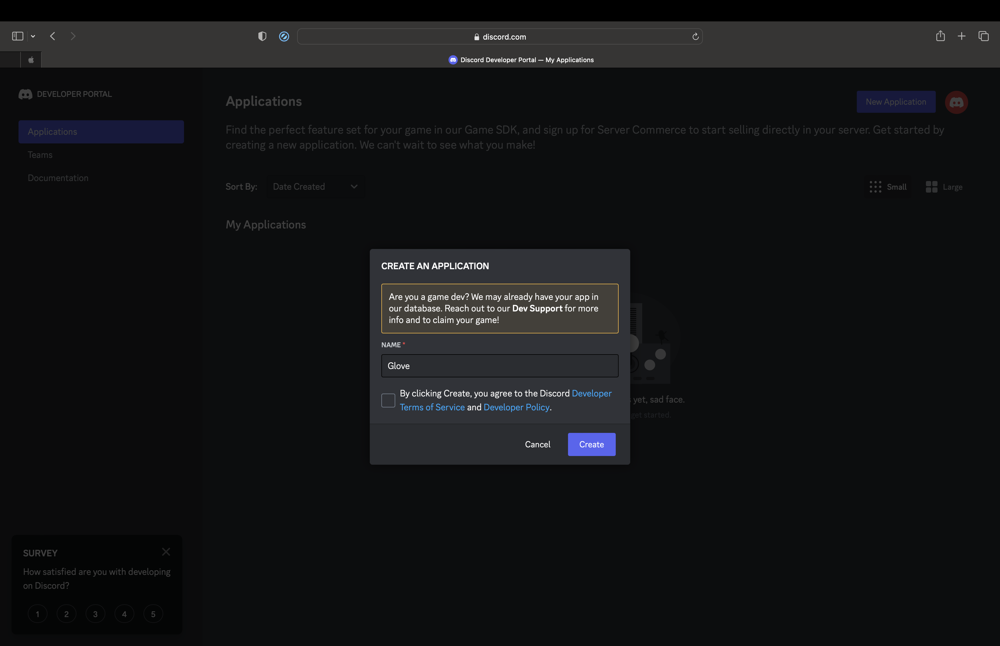
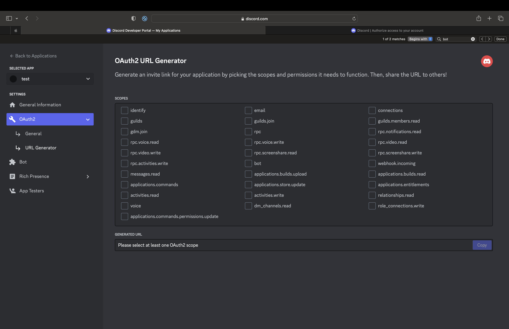
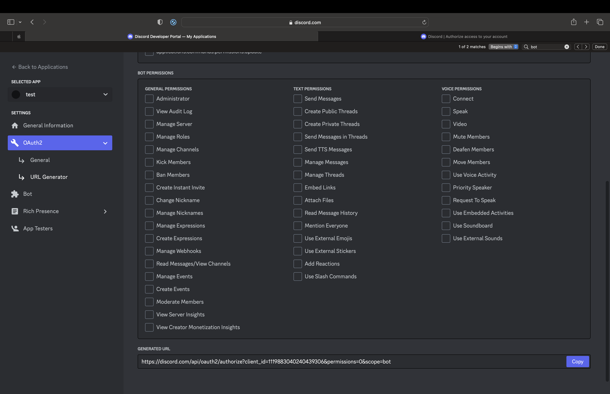
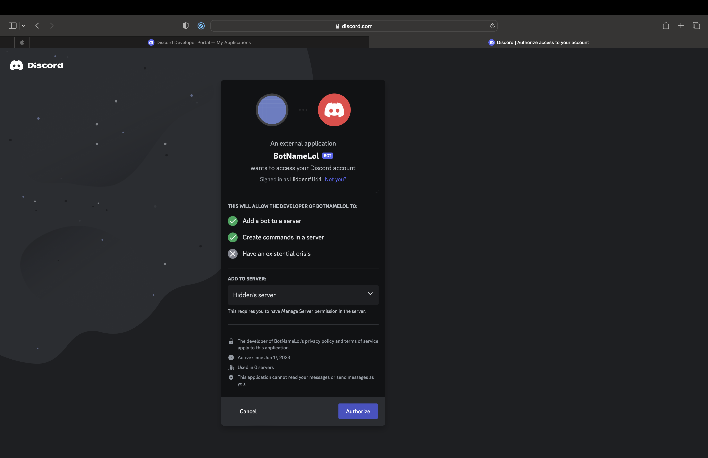
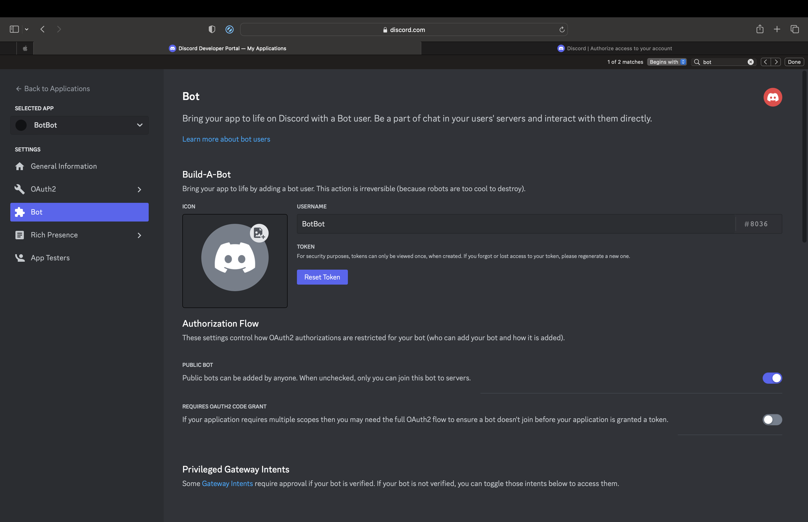
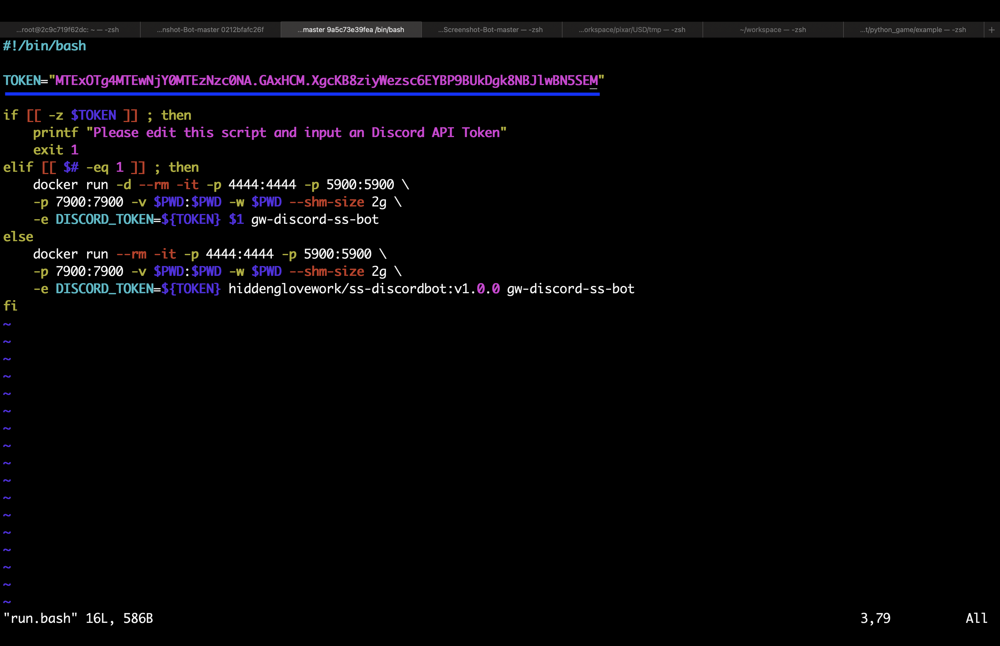

# 🤖gloveworks_screenshot_bot

## About
### This is a discord screenshot bot specifically for the Counter Strike Community: Gloveworks


## Purpose
### Gloveworks hosts a monthly contest where the top player can receive a prize. However, there have been times where it has been uncertain who was the top player on the last day of the month at exactly 7 PM PST. That's what this bot aims to solve! This Discord Bot will take a screenshot of a website on the last day of the month at 7 PM PST. It also allows you to request a screenshot on demand.

## Prerequisite
### A linux machine configured with PST time
### A docker engine on your machine: please feel free to consult the Docker Website on how to install it.
### A discord bot created through the Discord Developer Portal - I will show you how to do this
### 2 GBs

## How does it work?
### The python script is what activates the bot, but the python libraries is what makes the magic happen
* python3-discord (python module for discord APIs)
* python3-selenium (python module for selenium - supports screenshots and much more automation)
* apscheduler (python module allows us to choose when the bot wakes up and takes a screenshot)
* discord_ext_bot (python module for discord bot APIs)
* webdriver_manager (python module for spinning up chromium from python)
### The docker image is just a nice way to package all of the dependencies that is required by the python script, and also freeze the software such that Gloveworks can dependently rely on this bot. It uses an existing docker image seleniarm/standalone-chromium, which is a modified Debian Linux image that supports automation capabilities inside docker.

## Create and invite your own discord bot
1. Log into the discord developer portal: https://discord.com/developers/applications

2. Create new application, name it whatever you want, and agree to the ToS

3. Once the page refreshes, go to OAuth2, and click on URL Generator

4. Under "Scopes", checkbox "bot"

5. Scroll to the bottom, copy the Generated URL and paste it into an address bar in your browser

6. Invite it to your server

7. Head back to the Discord Developer Page and configure the bots username, and click "Reset" token

Remember the token, the bot will need it to come online! If you forget it, you will have to regenerate it!
Congratulations you just created and invited your own discord bot!

## How to build the docker image from scratch (you don't have to do this if you just want to use the program)
```
./build.bash <insert_new_docker_image_name>
```
## How to configure
### Drop your API token inside the run.bash script

## How to start the docker image
Grab your Bot's token and edit the run.bash script with your token

```
./run.bash
```

## How to kill the docker image
```
docker stop <insert_docker_container_id>
```

## How to test the discord bot:
```
#in the discord channel where the bot is active type this message:
@<insert_bot_name> !screenshot <insert_url>
```

## Help(Feature Requests/Bug fixes)
### Troubleshoot: modify the run.sh script to not run the docker container as "-d" detach mode but instead "--it" interactive mode and replace gw-discord-ss-bot with /bin/bash
### Contact Hidden through gloveworks and forward me any logs. I will do my best to troubleshoot it
